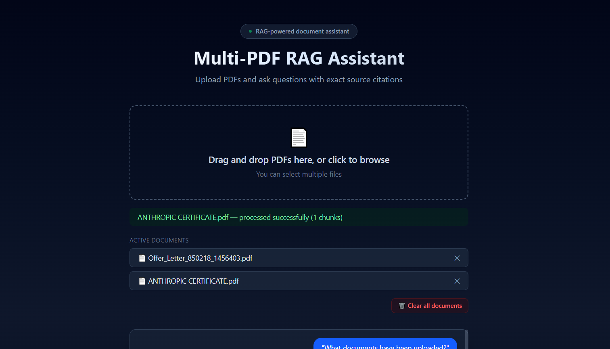
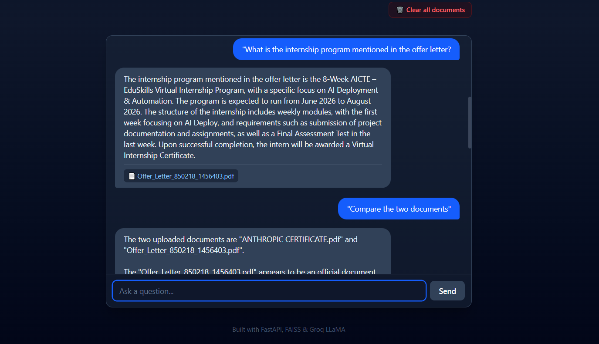

# Multi-PDF RAG Assistant

An AI-powered assistant that lets you upload multiple PDFs and ask questions about them in natural language. It answers using only the content of your documents and cites the exact source file for every answer.

Built using **RAG (Retrieval Augmented Generation)** — the core architecture behind modern AI products like ChatGPT's file upload, Notion AI, and Perplexity.

🔗 **Live App:** [multi-pdf-rag-assistant.vercel.app](https://multi-pdf-rag-assistant.vercel.app/)
🔗 **Backend API:** [multi-pdf-rag-assistant-m6v3.onrender.com](https://multi-pdf-rag-assistant-m6v3.onrender.com)

> ⚠️ Note: The backend is hosted on Render's free tier, which spins down after inactivity. The first request after idle time may take 30–60 seconds to respond while the server wakes up.

---

## 📸 Screenshots

<!-- Add screenshots here. See "Adding Screenshots" section below for instructions. -->

| Upload Interface | Chat with Source Citations |
|---|---|
|  |  |

---

## ✨ Features

- **Multi-PDF upload** — drag & drop or click to browse, supports multiple files at once
- **Semantic search** — finds relevant content by meaning, not just keyword matching
- **Source-cited answers** — every AI response shows exactly which PDF it came from
- **Document management** — remove individual documents or clear all at once
- **Robust error handling** — gracefully handles corrupted, password-protected, or invalid files
- **Real-time chat UI** — typing indicators, smooth animations, auto-scroll

---

## 🧠 How It Works (RAG Pipeline)

1. **Upload** — PDFs are parsed and their text is extracted
2. **Chunking** — extracted text is split into smaller overlapping segments
3. **Embedding** — each chunk is converted into a vector (numerical representation of meaning) using a sentence-transformer model
4. **Indexing** — vectors are stored in a FAISS index for fast similarity search
5. **Query** — when a question is asked, it's also converted into a vector
6. **Retrieval** — FAISS finds the most semantically similar chunks to the question
7. **Generation** — only the relevant chunks (not the entire document) are sent to an LLM (Groq LLaMA), which generates a grounded answer
8. **Citation** — the source filename is tracked and returned alongside the answer

This retrieval-first approach keeps responses fast, accurate, and grounded in the actual uploaded content — rather than relying on the model's general knowledge or hallucinating.

---

## 🛠️ Tech Stack

**Backend**
- FastAPI — REST API framework
- pdfplumber — PDF text extraction
- Hugging Face Inference API — text embeddings
- FAISS — vector similarity search
- Groq (LLaMA 3.3 70B) — answer generation

**Frontend**
- React + Vite
- Tailwind CSS

**Deployment**
- Backend: Render
- Frontend: Vercel

---

## 📁 Project Structure

```
multi-pdf-rag/
├── backend/
│   ├── app.py                  # FastAPI entry point
│   ├── config.py                # App configuration & logging
│   ├── requirements.txt
│   ├── routes/
│   │   ├── upload.py             # Upload, clear, remove endpoints
│   │   └── chat.py               # Chat endpoint
│   └── services/
│       ├── parser.py             # PDF text extraction
│       ├── chunker.py            # Text chunking
│       ├── embeddings.py         # Embedding generation
│       ├── vector_store.py       # FAISS index management
│       └── rag.py                # Groq LLM integration
│
└── frontend/
    ├── src/
    │   ├── App.jsx
    │   └── components/
    │       ├── PdfUploader.jsx
    │       └── ChatBox.jsx
    └── package.json
```

---

## 🔒 Security Considerations

- API keys are stored as environment variables, never hardcoded or committed to version control
- File uploads are validated by content signature (not just file extension), size-limited, and sanitized against path traversal
- User-facing errors are generic; full error details are logged server-side only
- CORS is explicitly restricted to known frontend origins

**Known limitation:** This is a single-session demo without user authentication. Uploaded documents are shared across all visitors until manually cleared — there is no per-user data isolation. A production version would add authentication and session-based (or per-user) document scoping.

---

## 🚀 Running Locally

### Backend

```bash
cd backend
python -m venv venv
venv\Scripts\activate          # Windows
# source venv/bin/activate     # Mac/Linux

pip install -r requirements.txt
```

Create a `.env` file in `backend/`:
```
GROQ_API_KEY=your_groq_api_key
HF_API_TOKEN=your_huggingface_api_token
```

Run the server:
```bash
uvicorn app:app --reload
```

### Frontend

```bash
cd frontend
npm install
```

Create a `.env` file in `frontend/`:
```
VITE_API_BASE=http://127.0.0.1:8000
```

Run the dev server:
```bash
npm run dev
```

---

## 🎯 What I Learned

- Building a complete RAG pipeline from scratch — chunking, embeddings, vector search, and grounded generation
- Working with vector databases (FAISS) and semantic search
- Designing and structuring a production-style FastAPI backend
- Connecting a React frontend to a FastAPI backend, including CORS handling
- Debugging real deployment constraints (e.g., memory limits on free-tier hosting, and re-architecting the embedding approach to work around them)
- Implementing practical security measures: input validation, file upload safety, secrets management, and safe error handling

---

## 👤 Author

**Vivek Yadav**
GitHub: [@mevvek](https://github.com/mevvek)
BCA , Invertis University

---

## 📄 License

This project is open source and available for learning purposes.
